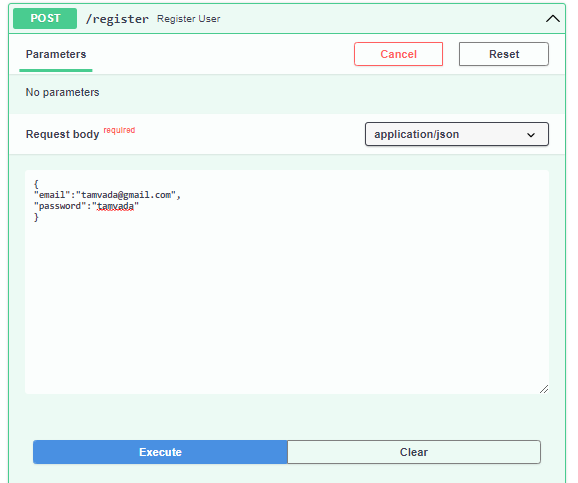
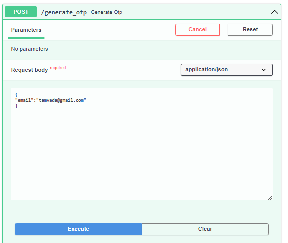
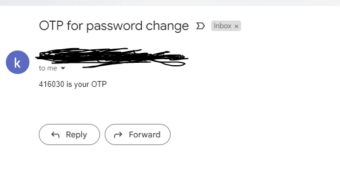
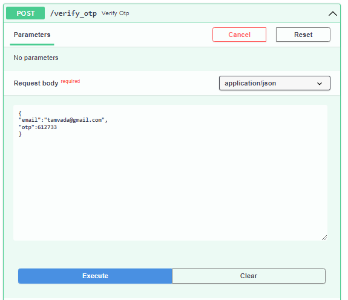
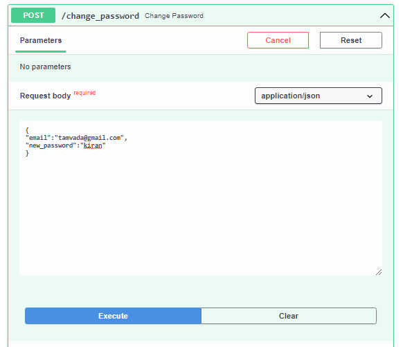

# Goal
- Backend system demonstrating Forgot password flow for a web based application.
- The application should involve below mentioned API’s:
   -  /generate_otp: API to generate OTP for the user and send the OTP to the user email.
  -   /verify_otp: API that verifies whether the OTP entered by user and generated by system is same or not.
  -   /change_password: API to change password of user after successful OTP verification.

---
## Installation
- Use  ``` pip install -r requirements.txt ``` to install required packages which are present in requirements file

---

## Run
- Use ```python main.py``` to run the application


---

>use  [http://127.0.0.1:8000/docs]
you will be redirected to swagger doc 
(Swagger allows you to describe the structure of your APIs so that machines can read them. The ability of APIs to describe their own structure is the root of all awesomeness in Swagger.) 

- swagger document looks like this.


## Hands on
- request body as shown in pictures.
- Register
  - 

- Generate otp
  - 

- we will receive mail as follows
    - 

- Verify otp
    - 

- change password
    - 


On selecting, you can use each API by providing required data 


 
